# 테스트 주도 개발 (TDD)

## 개요

테스트를 먼저 작성하라. 실패하는 것을 확인하라. 통과시킬 최소한의 코드를 작성하라.

**핵심 원칙:** 테스트가 실패하는 것을 직접 보지 않았다면, 그 테스트가 올바른 것을 검증하는지 알 수 없다.

**규칙의 문자(letter)를 어기는 것은 곧 규칙의 정신(spirit)을 어기는 것이다.**

## 사용 시점

**항상:**
- 새로운 기능
- 버그 수정
- 리팩터링
- 동작(behavior) 변경

**예외 (사람 파트너에게 물어볼 것):**
- 일회성 프로토타입
- 자동 생성된 코드
- 설정(configuration) 파일

"이번 한 번만 TDD를 건너뛸까?"라고 생각하고 있는가? 멈춰라. 그건 합리화다.

## 철의 법칙 (The Iron Law)

```
실패하는 테스트가 먼저 존재하지 않는 한, 프로덕션 코드를 작성하지 않는다
NO PRODUCTION CODE WITHOUT A FAILING TEST FIRST
```

테스트보다 먼저 코드를 작성했다면? 삭제하라. 처음부터 다시 시작하라.

**예외 없음:**
- "참고용"으로 남겨두지 말 것
- 테스트를 쓰면서 그 코드를 "각색(adapt)"하지 말 것
- 그 코드를 쳐다보지도 말 것
- 삭제는 진짜 삭제를 의미한다

테스트로부터 새롭게(fresh) 구현하라. 그게 전부다.

## Red-Green-Review (Human-in-the-Loop)

에이전트 혼자 코드를 밀어붙이는 순수 TDD 루프는, 사람 파트너가 잘못된 방향을 뒤늦게 발견하면 되돌리는 비용이 크다. 그래서 이 루프는 사이클마다 두 지점에서 사람이 개입하고 커밋으로 이력을 남긴다: **목표/계획이 확정되는 시점**과 **구현이 끝나고 검토받는 시점**. 두 시점 모두 사람의 승인 없이는 다음 단계로 넘어가지 않는다.

```dot
digraph tdd_cycle {
    rankdir=LR;
    plan [label="RED\n목표 설정 + Plan.md\n+ 실패하는 테스트", shape=box, style=filled, fillcolor="#ffcccc"];
    human_red [label="인간 검토\n(계획)", shape=diamond];
    commit_red [label="커밋\n(계획+RED)", shape=box];
    green [label="GREEN\n최소한의 코드\n+ 통과 확인", shape=box, style=filled, fillcolor="#ccffcc"];
    review [label="REVIEW\n계획 대비 코드 검토\n+ 리팩토링", shape=box, style=filled, fillcolor="#ccccff"];
    human_review [label="인간 검토\n(코드)", shape=diamond];
    commit_review [label="커밋\n(구현)", shape=box];
    next [label="다음", shape=ellipse];

    plan -> human_red;
    human_red -> commit_red [label="승인"];
    human_red -> plan [label="반려"];
    commit_red -> green;
    green -> review;
    review -> human_review;
    human_review -> commit_review [label="승인"];
    human_review -> review [label="반려/리팩토링 요청"];
    commit_review -> next;
    next -> plan;
}
```



### 1. RED - 목표 설정 + Plan.md + 실패하는 테스트 + 인간 검토 + 커밋

무엇이 일어나야 하는지를 정확히 설정하라. 모호하면 구현으로 넘어가지 말고 사람 파트너에게 물어라 — 잘못된 목표를 향해 완벽하게 구현해봤자 되돌리는 비용이 더 크다.

**Plan.md 작성**: 이번 사이클에서 구현할 동작과 접근 방식을 문서화하라. 사람이 코드를 보기 전에 "무엇을, 왜, 어떻게"를 승인할 수 있는 체크포인트다. 아래는 여전히 그대로 지킨다 — Plan.md가 그 위에 사람이 개입할 지점을 추가하는 것이지, 대체하는 게 아니다:

<Good>
```python
def test_retries_failed_operations_3_times():
    attempts = 0

    def operation():
        nonlocal attempts
        attempts += 1
        if attempts < 3:
            raise RuntimeError("fail")
        return "success"

    result = retry_operation(operation)

    assert result == "success"
    assert attempts == 3
```
명확한 이름, 실제 동작 검증, 한 가지만 검증
</Good>

<Bad>
```python
def test_retry_works(mocker):
    mock = mocker.Mock(side_effect=[RuntimeError(), RuntimeError(), "success"])
    retry_operation(mock)
    assert mock.call_count == 3
```
모호한 이름, 실제 코드가 아닌 mock을 검증
</Bad>

**요건:**
- 하나의 동작(behavior)
- 명확한 이름
- 실제 코드 (불가피한 경우가 아니면 mock 사용 금지)

**실패하는 것을 직접 보기 — 필수. 절대 건너뛰지 말 것.**

```bash
pytest path/to/test_file.py
```

다음을 확인하라:
- 테스트가 실패한다 (에러가 아니라)
- 실패 메시지가 예상한 그대로다
- 기능이 없어서 실패한다 (오타 때문이 아니라)

**테스트가 통과한다고?** 이미 존재하는 동작을 검증하고 있는 것이다. 테스트를 고쳐라.

**테스트가 에러를 낸다고?** 에러를 고치고, 제대로 실패할 때까지 다시 실행하라.

**인간 검토 + 커밋**: Plan.md와 실패하는 테스트를 사람 파트너에게 제시하고 검토를 요청하라. 승인 전에는 구현(GREEN)으로 넘어가지 말라. 승인받으면 Plan.md + 테스트를 커밋하라 — 이 커밋이 "우리가 무엇을 만들기로 합의했는가"의 기록이 된다.

### 2. GREEN - 최소한의 코드

RED에서 승인된 목표를 달성하는 가장 단순한 코드를 작성하라.

<Good>
```python
def retry_operation(fn):
    for i in range(3):
        try:
            return fn()
        except Exception as e:
            if i == 2:
                raise
    raise RuntimeError("unreachable")
```
통과시킬 만큼만
</Good>

<Bad>
```python
def retry_operation(
    fn,
    max_retries=3,
    backoff="linear",  # "linear" | "exponential"
    on_retry=None,
):
    # YAGNI (You Aren't Gonna Need It)
    ...
```
과도한 설계
</Bad>

기능을 추가하지 말고, 다른 코드를 리팩터링하지 말고, Plan.md와 테스트가 요구하는 것 이상으로 "개선"하지 말라.

**통과하는 것을 직접 보기 — 필수.**

```bash
pytest path/to/test_file.py
```

다음을 확인하라:
- 테스트가 통과한다
- 다른 테스트들도 여전히 통과한다
- 출력이 깨끗하다 (에러, 경고 없음)

**테스트가 실패한다?** 테스트가 아니라 코드를 고쳐라.

**다른 테스트가 실패한다?** 지금 당장 고쳐라.

이 단계에서는 아직 커밋하지 않는다 — REVIEW까지 기다려라. 사람 파트너가 Plan과 최종 결과물을 한 번에 같이 볼 수 있어야 계획 이탈 여부를 판단하기 쉽다.

### 3. REVIEW - 계획 대비 코드 검토 + 인간 검토 + 커밋

GREEN에서 작성된 코드를 Plan.md와 대조해 검토하라:
- Plan에 없는 것이 구현되지는 않았는가? (스코프 밖 추가 여부)
- Plan의 목표가 실제로 달성됐는가?
- 리팩토링이 필요한가?

리팩토링이 필요하면(중복 제거, 이름 개선, 헬퍼 추출) 수행하고, 테스트가 여전히 그린인지 재확인하라. 리팩토링 중 동작을 추가하지 말라.

**인간 검토 + 커밋**: 최종 코드(와 리팩토링 결과)를 사람 파트너에게 제시하고 검토를 요청하라. 승인되면 구현을 커밋하라. 반려되면 지적된 부분을 GREEN/REVIEW로 돌아가 고치고 다시 검토받아라.

### 반복

다음 목표에 대해 RED부터 다시 시작하라.

## 좋은 테스트

| 품질 | 좋음 | 나쁨 |
|------|------|------|
| **최소성** | 한 가지만 검증. 이름에 "and"가 들어가는가? 분리하라. | `test_validates_email_and_domain_and_whitespace` |
| **명확성** | 이름이 동작을 설명한다 | `test_test1` |
| **의도 표현** | 원하는 API를 보여준다 | 코드가 무엇을 해야 하는지 가린다 |

## 왜 순서가 중요한가

**"코드를 먼저 짜고 나중에 테스트로 검증할게요"**

코드 이후에 작성된 테스트는 즉시 통과한다. 즉시 통과한다는 것은 아무것도 증명하지 못한다:
- 잘못된 것을 검증하고 있을 수 있다
- 동작이 아니라 구현(implementation)을 검증하고 있을 수 있다
- 잊어버린 엣지 케이스를 놓쳤을 수 있다
- 그 테스트가 버그를 잡는 것을 한 번도 보지 못했다

테스트 우선(test-first)은 테스트가 실패하는 것을 강제로 보게 함으로써, 그 테스트가 실제로 무언가를 검증하고 있음을 증명한다.

**"이미 모든 엣지 케이스를 수동으로 테스트했어요"**

수동 테스트는 임시방편(ad-hoc)이다. 모든 것을 테스트했다고 생각하지만:
- 무엇을 테스트했는지 기록이 없다
- 코드가 변경될 때 다시 실행할 수 없다
- 압박 상황에서 케이스를 잊기 쉽다
- "내가 해봤을 때는 됐어요" ≠ 포괄적

자동화된 테스트는 체계적이다. 매번 동일한 방식으로 실행된다.

**"X시간 작업한 걸 지우는 건 낭비예요"**

매몰비용(sunk cost) 오류다. 시간은 이미 지나갔다. 지금 당신의 선택지는:
- 삭제하고 TDD로 다시 작성 (X시간 더, 높은 확신)
- 그대로 두고 나중에 테스트 추가 (30분, 낮은 확신, 버그 가능성 큼)

진짜 "낭비"는 신뢰할 수 없는 코드를 유지하는 것이다. 진짜 테스트가 없는 동작 코드는 기술 부채다.

**"TDD는 교조적이에요. 실용적이라는 건 상황에 맞게 조정하는 것"**

TDD가 바로 실용적이다:
- 커밋 전에 버그를 발견 (나중에 디버깅하는 것보다 빠름)
- 회귀(regression) 방지 (테스트가 깨짐을 즉시 잡아냄)
- 동작을 문서화 (테스트가 코드 사용법을 보여줌)
- 자유로운 리팩터링 가능 (마음껏 바꿔도 테스트가 깨짐을 잡음)

"실용적"이라는 이름의 지름길 = 프로덕션에서의 디버깅 = 더 느리다.

**"테스트를 나중에 써도 같은 목표를 달성해요 - 정신이 중요하지 의식이 중요한 게 아니에요"**

아니다. 사후(after) 테스트는 "이 코드가 무엇을 하는가?"에 답한다. 사전(first) 테스트는 "이 코드가 무엇을 해야 하는가?"에 답한다.

사후 테스트는 당신의 구현에 편향(bias)되어 있다. 요구되는 것이 아니라 당신이 만든 것을 검증한다. 발견된 엣지 케이스가 아니라 당신이 기억하는 엣지 케이스를 검증한다.

사전 테스트는 구현 전에 엣지 케이스 발견을 강제한다. 사후 테스트는 당신이 모든 것을 기억했는지 검증한다 (당신은 기억하지 못했다).

사후에 30분 동안 테스트를 쓰는 것 ≠ TDD. 커버리지는 얻지만, 테스트가 작동한다는 증명은 잃는다.

## 흔한 합리화들

| 변명 | 현실 |
|------|------|
| "너무 단순해서 테스트할 게 없어요" | 단순한 코드도 깨진다. 테스트는 30초면 쓴다. |
| "나중에 테스트할게요" | 즉시 통과하는 테스트는 아무것도 증명하지 않는다. |
| "사후 테스트도 같은 목표 달성" | 사후 = "무엇을 하는가?" 사전 = "무엇을 해야 하는가?" |
| "이미 수동으로 테스트했어요" | 임시방편 ≠ 체계적. 기록 없음, 재실행 불가. |
| "X시간 작업 지우는 건 낭비" | 매몰비용 오류. 미검증 코드 유지가 기술 부채. |
| "참고용으로 두고 테스트부터" | 결국 그 코드를 각색하게 된다. 그게 사후 테스트다. 삭제는 진짜 삭제다. |
| "먼저 탐색(explore)이 필요해요" | 좋다. 탐색물은 버리고, TDD로 시작하라. |
| "테스트가 어렵다는 건 설계가 불명확하다는 뜻" | 테스트의 말을 들어라. 테스트하기 어려우면 사용하기도 어렵다. |
| "TDD는 나를 느리게 해요" | TDD가 디버깅보다 빠르다. 실용적 = 테스트 우선. |
| "수동 테스트가 더 빨라요" | 수동은 엣지 케이스를 증명하지 못한다. 매번 다시 테스트해야 한다. |
| "기존 코드엔 테스트가 없어요" | 당신이 그 코드를 개선하는 중이다. 기존 코드에 대한 테스트도 추가하라. |

## 위험 신호 (Red Flags) - 멈추고 처음부터

- 테스트보다 코드가 먼저 있다
- 구현 후에 테스트를 쓴다
- 테스트가 즉시 통과한다
- 왜 테스트가 실패했는지 설명할 수 없다
- 테스트를 "나중에" 추가한다
- "이번 한 번만"이라고 합리화한다
- "이미 수동으로 테스트했어요"
- "사후 테스트도 같은 목적을 달성해요"
- "정신이 중요하지 의식이 중요한 게 아니에요"
- "참고용으로 두고" 또는 "기존 코드 각색"
- "이미 X시간 썼는데, 지우는 건 낭비"
- "TDD는 교조적, 나는 실용적"
- "이건 다른 경우인데..."
- "Plan.md는 생략하고 바로 구현할게요, 어차피 간단해요"
- "일단 구현부터 하고 나중에 한꺼번에 검토받을게요"

**이 모든 것은 다음을 의미한다: 코드를 삭제하라. TDD로 다시 시작하라. (뒤의 두 개는: 커밋하지 말고 계획/구현을 사람 파트너에게 먼저 보여라.)**

## 예시: 버그 수정

**버그:** 빈 이메일이 허용됨

**RED — Plan.md**
```
목표: submit_form이 빈 이메일/공백만 있는 이메일을 거부하고
      {"error": "Email required"}를 반환하게 한다.
접근: data.get("email", "")로 값을 꺼내 .strip()이 falsy면 에러 반환.
```

**RED — 실패하는 테스트**
```python
def test_rejects_empty_email():
    result = submit_form({"email": ""})
    assert result["error"] == "Email required"
```

**RED 검증**
```bash
$ pytest
FAILED: KeyError: 'error'   (또는 'Email required'를 기대했으나 다른 값)
```

**RED — 인간 검토 + 커밋**: Plan.md와 실패하는 테스트를 보여주고 승인받은 뒤 커밋한다.

**GREEN**
```python
def submit_form(data):
    email = data.get("email", "")
    if not email.strip():
        return {"error": "Email required"}
    # ...
```

**GREEN 검증**
```bash
$ pytest
PASSED
```

**REVIEW**
Plan.md와 대조: 이메일 외 다른 필드 검증이 추가되지 않았는지 확인. 지금은 검증 규칙이 하나뿐이라 리팩토링(로직 추출) 불필요 — 여러 필드에 대한 검증이 필요해지면 그때 추출한다. 사람 파트너에게 최종 코드를 보여주고 승인받은 뒤 커밋한다.

## 검증 체크리스트

작업을 완료(complete)로 표시하기 전에:

- [ ] Plan.md가 존재하고 사람 파트너의 승인을 받았다
- [ ] 모든 새 함수/메서드에 테스트가 있다
- [ ] 각 테스트가 실패하는 것을 직접 보고 구현했다
- [ ] 각 테스트가 예상한 이유로 실패했다 (오타가 아니라 기능 부재로)
- [ ] 각 테스트를 통과시키는 최소한의 코드를 작성했다
- [ ] 모든 테스트가 통과한다
- [ ] 출력이 깨끗하다 (에러, 경고 없음)
- [ ] 테스트가 실제 코드를 사용한다 (mock은 불가피할 때만)
- [ ] 엣지 케이스와 에러 케이스가 커버되어 있다
- [ ] 구현이 Plan.md 범위를 벗어나지 않았다 (스코프 밖 추가 없음)
- [ ] 최종 코드가 사람 파트너의 검토와 승인을 받았다
- [ ] RED(계획+테스트)와 REVIEW(구현) 각각 별도로 커밋되었다

체크박스를 모두 채울 수 없다면? TDD를 건너뛴 것이다. 처음부터 다시 시작하라.

## 막혔을 때

| 문제 | 해결 |
|------|------|
| 어떻게 테스트할지 모르겠다 | 원하는 API를 먼저 적어보라. assertion부터 작성하라. 사람 파트너에게 물어보라. |
| 테스트가 너무 복잡하다 | 설계가 너무 복잡하다. 인터페이스를 단순화하라. |
| 모든 것을 mock해야 한다 | 코드가 너무 결합(coupled)되어 있다. 의존성 주입(DI)을 사용하라. |
| 테스트 셋업이 거대하다 | 헬퍼를 추출하라. 그래도 복잡하면 설계를 단순화하라. |

## 디버깅 통합

버그를 발견했는가? 그 버그를 재현하는 실패하는 테스트를 먼저 작성하라. TDD 사이클을 따르라. 그 테스트가 수정을 증명하고 회귀를 방지한다.

테스트 없이 버그를 수정하지 말라.

## 테스트 안티패턴

mock이나 테스트 유틸리티를 추가할 때, 흔한 함정을 피하라:
- 실제 동작 대신 mock 동작을 테스트하기
- 프로덕션 클래스에 테스트 전용 메서드를 추가하기
- 의존성을 이해하지 못한 채 mock하기

## pytest 관련 추가 팁 (Python 특화)

### 픽스처(Fixtures)는 절제해서 사용하라

```python
# 좋음: 분명히 재사용되는 셋업만 픽스처로
@pytest.fixture
def temp_db():
    db = create_in_memory_db()
    yield db
    db.close()

def test_user_creation(temp_db):
    user = create_user(temp_db, name="Alice")
    assert user.id is not None
```

픽스처가 너무 많아지면 테스트의 의도가 흐려진다. 단순한 셋업은 테스트 안에 그대로 두는 편이 명확할 때가 많다.

### parametrize는 같은 동작의 여러 입력에만 사용하라

```python
# 좋음: 같은 동작 규칙, 여러 입력
@pytest.mark.parametrize("email", ["", "   ", "\t\n"])
def test_rejects_blank_email(email):
    result = submit_form({"email": email})
    assert result["error"] == "Email required"
```

서로 다른 동작을 parametrize로 묶지 말라. 그건 테스트 한 개가 아니라 여러 개로 나뉘어야 한다.

### mock은 외부 경계에서만

`unittest.mock` 또는 `pytest-mock`의 `mocker`를 쓸 때는, 우리가 제어할 수 없는 경계(네트워크, 파일시스템, 시간 등)에서만 사용하라. 우리 코드 내부 모듈 사이의 호출을 mock하기 시작했다면, 결합도가 너무 높다는 신호다.

### 테스트 실행 명령

```bash
# 단일 파일
pytest path/to/test_file.py

# 단일 테스트
pytest path/to/test_file.py::test_specific_case

# 첫 실패에서 멈춤 (빠른 RED 확인용)
pytest -x

# 자세한 출력
pytest -v

# 출력(print) 캡처 끔 (디버깅용)
pytest -s
```

## 최종 규칙

```
프로덕션 코드 → 테스트가 존재하고, 먼저 실패했다
커밋 → Plan.md/RED 승인, 그리고 별도로 최종 코드 승인, 둘 다 사람 파트너로부터 받았다
그 외 → TDD가 아니다
```

사람 파트너의 허가 없이는 예외 없음.
